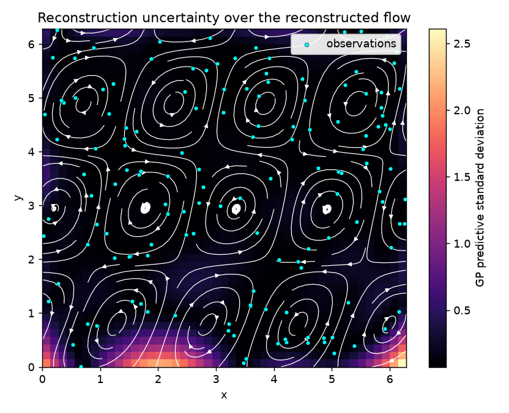
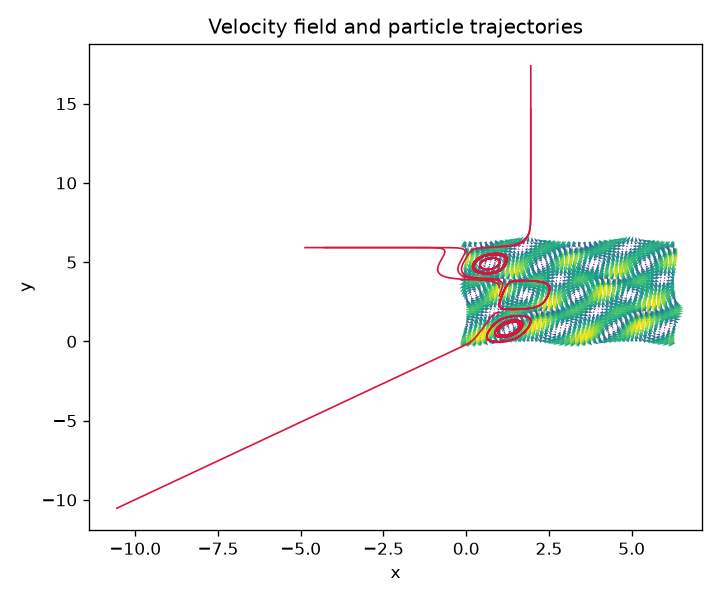

# gaussian-process-flow-modeling

*Origin: Originally developed for the Data Analysis (MITx 6.419x) online course; refactored and open-sourced in July 2026.*



The image above is the whole project in one frame. A divergence-free velocity
field is reconstructed from a couple of hundred scattered, noisy measurements by
a Gaussian process. The white streamlines are the reconstructed flow. The
background is the posterior standard deviation, the model's own estimate of how
unsure it is: dark where measurements are dense, bright along the sparse bottom
edge where the reconstruction is openly guessing. The cyan dots are the
observations that anchor it. A Gaussian process does not just draw a field, it
tells you where to trust it.

## The gallery

| Hero: uncertainty map | Field and trajectories |
|---|---|
|  |  |
| Posterior standard deviation with reconstructed streamlines and observation sites. | The true field with a line of particles advected by fourth-order Runge-Kutta. |

## Measured results

Produced this session by `scripts/simulate.py --n-obs 200 --grid 45` on the
synthetic field, seed 0, 140 training observations at noise 0.05, held out
against the noise-free analytic ground truth. The full metrics file is
`results/metrics.json`.

| Quantity | Value |
|----------|-------|
| Held-out reconstruction RMSE (vs ground truth) | 0.232 |
| Full-grid reconstruction RMSE | 0.277 |
| Held-out mean NLPD (lower is better) | -1.21 |
| Coverage of the 1-sigma band (nominal 0.68) | 0.83 |
| Coverage of the 2-sigma band (nominal 0.95) | 1.00 |
| Log marginal likelihood (u + v components) | 101.2 |
| Residual divergence as a fraction of gradient magnitude | 0.5% |

The RMSE is well below the spread of the velocities, so the mean field is
accurate. The coverage numbers run a little conservative, wider error bars than
strictly needed, which is the safe direction for an uncertainty estimate to err
on this small a sample. The residual divergence is finite-difference error in the
numerical check, not a real source or sink: the stream-function construction is
incompressible analytically, and a test confirms the residual shrinks as the grid
is refined.

The committed model artifact `results/gp_flow_model.joblib` (about 330 KB) is the
fitted GP, ready for inference without refitting.

## Start here: the narrated notebook

`notebooks/demo.ipynb` is the guided entry point. It is executed and committed
with its outputs, and it walks through the whole story: the stream-function field,
the GP kernel, the posterior mean and variance, the hero uncertainty map, and the
Runge-Kutta advection, with the derivations kept short and pointed at
`docs/method.md`.

## Offline quickstart

No network, no field regeneration. Fit the GP on the committed sample and print
accuracy and calibration:

```bash
python -m venv .venv && source .venv/bin/activate   # Windows: .venv\Scripts\activate
pip install -e ".[dev]"
python examples/reconstruct_from_sample.py
```

To regenerate the hero figure, the metrics file, and the model artifact:

```bash
python scripts/simulate.py --n-obs 200 --grid 45
```

## How it works

- A divergence-free field is built as the curl of a sinusoidal stream function,
  so `du/dx + dv/dy = 0` holds by construction and velocities are sampled
  analytically off grid (`flowgp.field`).
- Each velocity component is reconstructed by an independent Gaussian process with
  an RBF plus white-noise kernel, returning posterior mean and standard deviation
  (`flowgp.gp`).
- Accuracy and calibration are scored with RMSE, negative log predictive density,
  and k-sigma coverage (`flowgp.metrics`).
- Particles are advected with fourth-order Runge-Kutta over a bilinear velocity
  interpolant, and any callable (including the GP posterior mean) can play the
  velocity role (`flowgp.advection`).

The math behind each of these lives in [docs/method.md](docs/method.md).

## Scope

The field is synthetic. `scripts/download_data.py` documents how to substitute a
real public surface-current product (OSCAR or HYCOM), but no live ocean archive is
fetched, both to keep the demo reproducible and because those archives are large
and access can be unreliable. The GP uses a stationary RBF kernel, so it does not
model anisotropy or non-stationarity, and advection is kinematic, with no dynamics
feedback.

## Layout

```
src/flowgp/     field, gp, metrics, advection, persistence, data
notebooks/      demo.ipynb (executed, the entry point)
scripts/        simulate.py, make_sample.py, download_data.py
examples/       reconstruct_from_sample.py (offline quickstart)
docs/           method.md (derivations)
data/           sample_observations.csv (committed sample) + README
results/        hero figure, trajectory figure, metrics.json, model artifact
tests/          pytest suite: divergence, GP, calibration, RK4, persistence
```

## Tests

```bash
pytest -q
ruff check src tests scripts examples
```

## License

MIT, see [LICENSE](LICENSE).

## Author

Aamir Malik. [GitHub](https://github.com/aamirmalik-dr) ·
[LinkedIn](https://linkedin.com/in/dr-aamirmalik)
